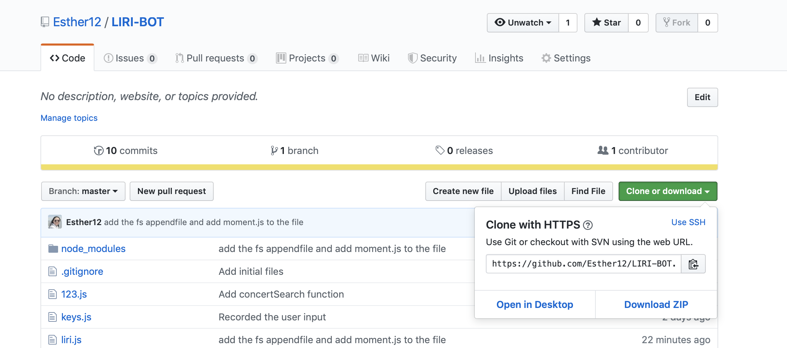
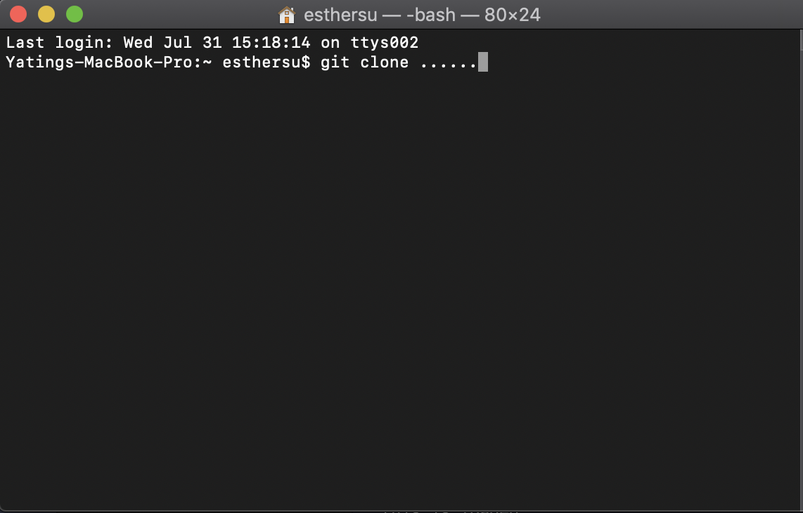
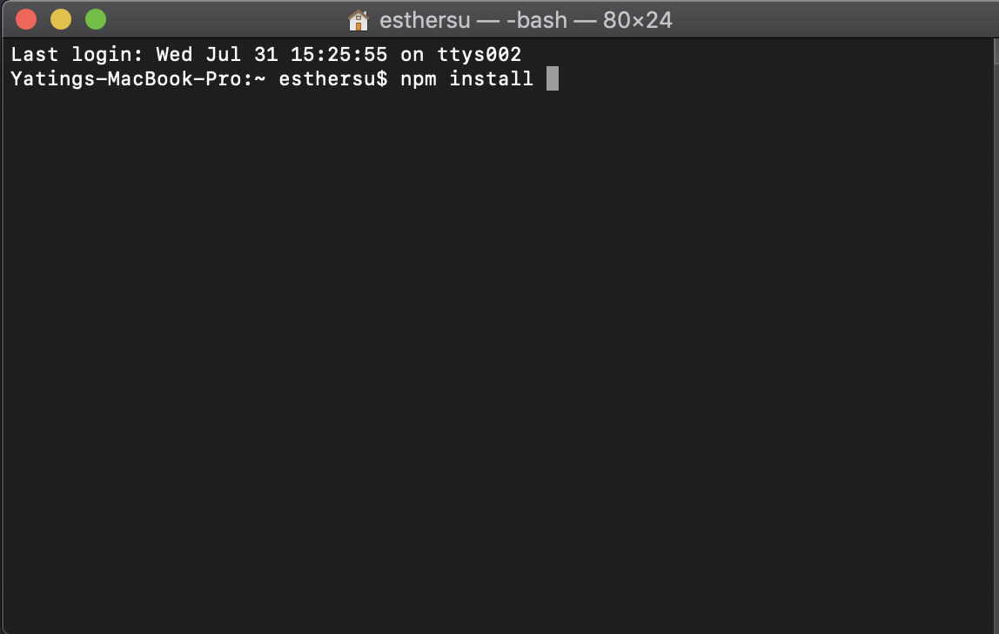
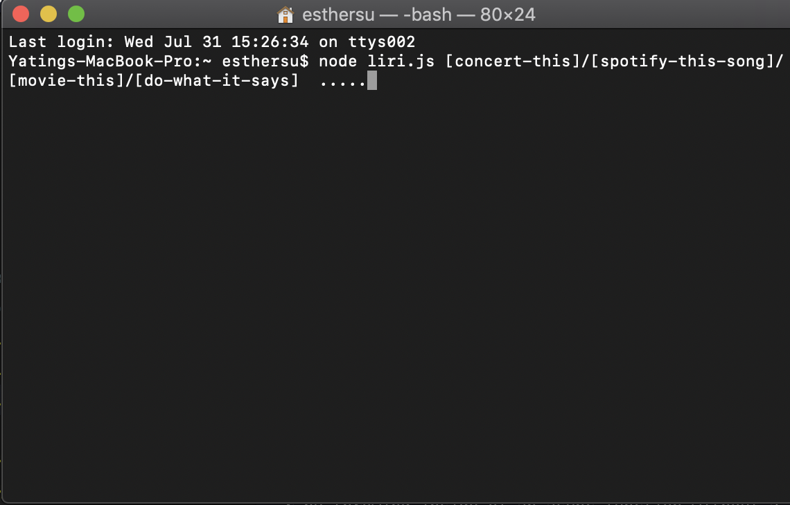

# LIRI-BOT
###### What the project does

Liri can help user search songs, movies, and concerts

###### Why the project is useful

It provides all the information user wants
>For example:
```
node liri.js concert-this Maroon 5
this is loaded
* Name of the venue : Seminole Hard Rock Hotel & Casino - Hollywood, FL
* Venue location : United States FL Hollywood
* Date of the Event : 10/25/2019
```

###### How users can get started with the project

Step 1:
>Get the git Clone web URL



Step 2:
>Going to your command line type and past the URL you just copy


Step 3:
>Install all packages that you need, by doing follow


Step 4:
>Finally you can use it!!!!


###### Where users can get help with your project
Find Bugs and give opinions help me grow!!!

###### Who maintains and contributes to the project

The Owner
